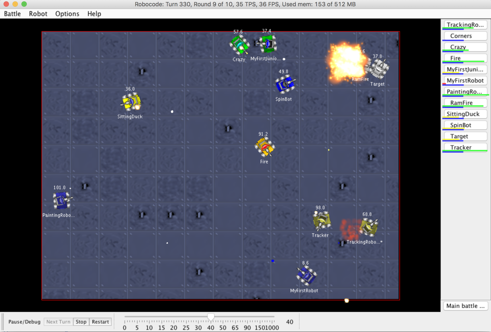

# Robocode and Genetic Algorithms



Prerequisite for completion of course Artificial Intelligence at CCC at UFCG.

## Import on Intellij Idea

1. Choose Import Project


2. Chosse Create project from existing sources


3. All ok, next


4. Mark all sources


5. Mark all libraries


6. Mark all modules suggested


7. Choose Java 8


8. Finish


## Installation

1. Check out the repo

2. Run the setup script:
   ```
    java -jar setup/robocode-1.9.3.3-setup.jar 
    ```
3. Specify the output folder relative to this project to `./dist` 

 

Thanks to sebastianzillessen to teach us in https://github.com/sebastianzillessen/robocode-intellij.

## How to run 

1. Make sure, that the Project SDK is configured correctly:
    > The code was tested with Java 8

2. Run `GPAlgorithm` main class
